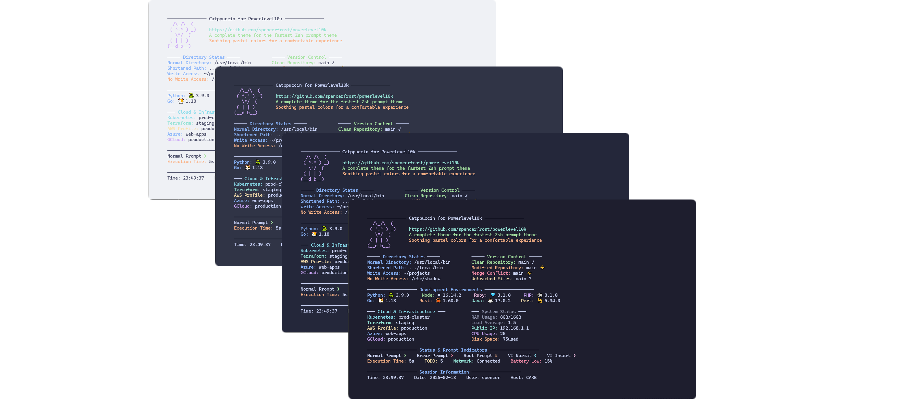
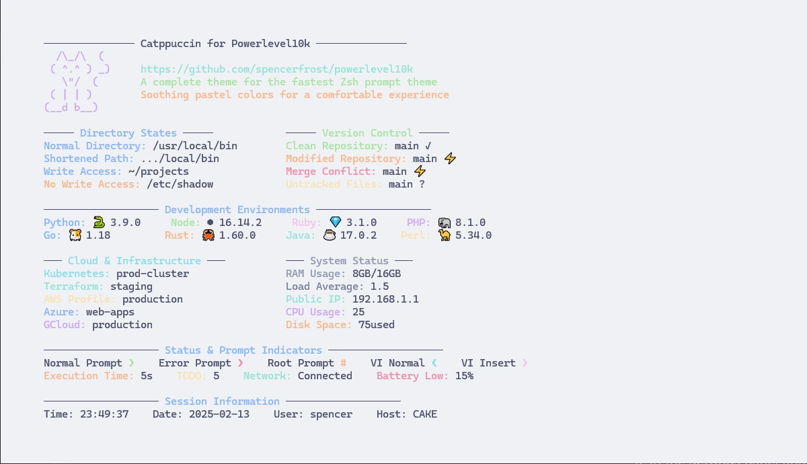
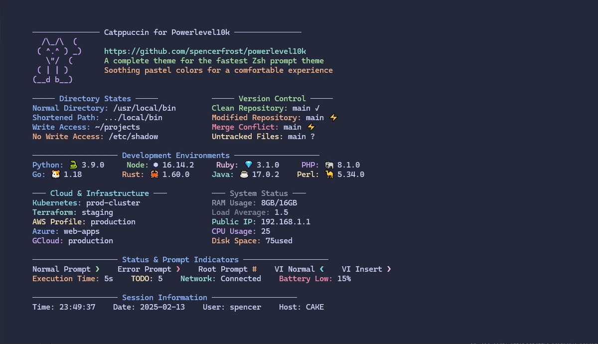
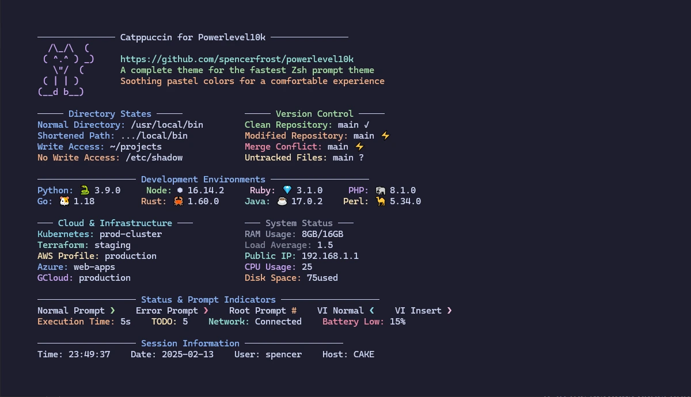

<h3 align="center">
	<br/>
	
	Catppuccin for <a href="https://github.com/romkatv/powerlevel10k">Powerlevel10k</a>
	
</h3>

<p align="center">
	<a href="https://github.com/spencerfrost/powerlevel10k/stargazers"></a>
	<a href="https://github.com/spencerfrost/powerlevel10k/issues"></a>
	<a href="https://github.com/spencerfrost/powerlevel10k/contributors"></a>
</p>

<p align="center">
	
</p>

## Previews

<details>
<summary>🌻 Latte</summary>

</details>
<details>
<summary>🪴 Frappé</summary>

</details>
<details>
<summary>🌺 Macchiato</summary>

</details>
<details>
<summary>🌿 Mocha</summary>

</details>

## Usage

1. Download your preferred theme variant:
```sh
# Example for macchiato
curl -o ~/.config/zsh/catppuccin-macchiato.zsh https://raw.githubusercontent.com/catppuccin/powerlevel10k/main/themes/macchiato.zsh
```

2. Source it in your `~/.p10k.zsh`:
```sh
source ~/.config/zsh/catppuccin-macchiato.zsh
```

## 🙋 FAQ

- Q: **_"Will this theme set my terminal background color?"_**\
  A: No, this theme only styles the Powerlevel10k prompt itself. For full terminal theming, you'll need to also install the Catppuccin theme for your terminal emulator. See [terminal ports](https://github.com/catppuccin/catppuccin#-ports-and-more) for your specific terminal.

- Q: **_"Where should I add the source line in my p10k configuration?"_**\
  A: Add it at the end of your `~/.p10k.zsh` file to ensure the theme colors override any existing settings.

- Q: **_"The colors don't look right in my terminal"_**\
  A: Ensure your terminal supports 24-bit true color and you have `COLORTERM=truecolor` set in your environment.

## 💝 Thanks to

- [Spencer Frost](https://github.com/spencerfrost)

&nbsp;

<p align="center">
	
</p>

<p align="center">
	Copyright &copy; 2021-present <a href="https://github.com/catppuccin" target="_blank">Catppuccin Org</a>
</p>

<p align="center">
	<a href="https://github.com/catppuccin/catppuccin/blob/main/LICENSE"></a>
</p>
